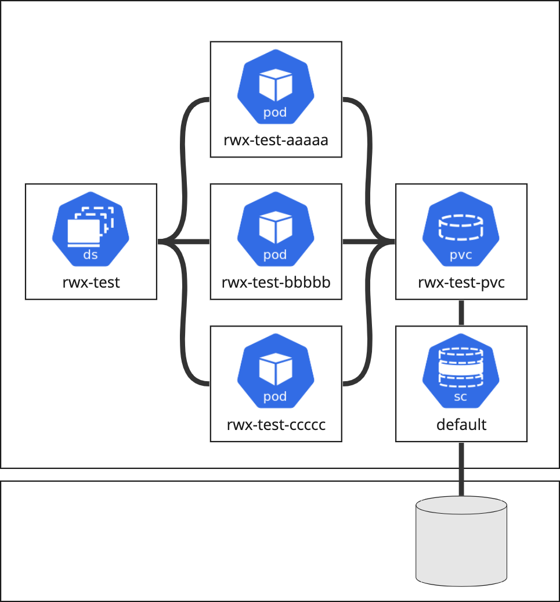

# RWX K8s Example

This repository contains an example workload to deploy on Kubernetes to test a ReadWriteMany persistent volume.

It's a simple DaemonSet where each pod will connect to the same PVC and add messages to their own file within a shared PVC. Using a DaemonSet ensures that pods are scheduled on different nodes.



## Deploying

This repo provides a Makefile to make deployment easy. It uses [ytt](https://carvel.dev/ytt/) to set the storage class value in the PVC, and uses [kapp](https://carvel.dev/kapp/) to deploy the DaemonSet and the PVC to the Kubernetes cluster.

```bash
make deploy
```

By default, it uses the `default` storage class. If the storage class in your cluster that supports RWX mode is not `default`, then set it with a variable:

```bash
STORAGE_CLASS=nfs make deploy
```
